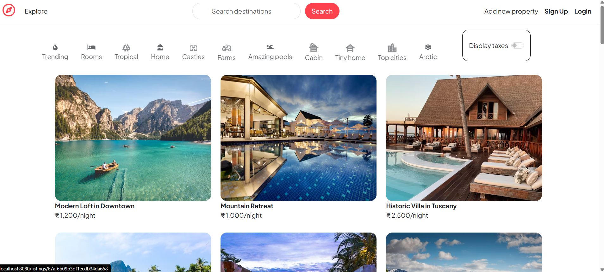
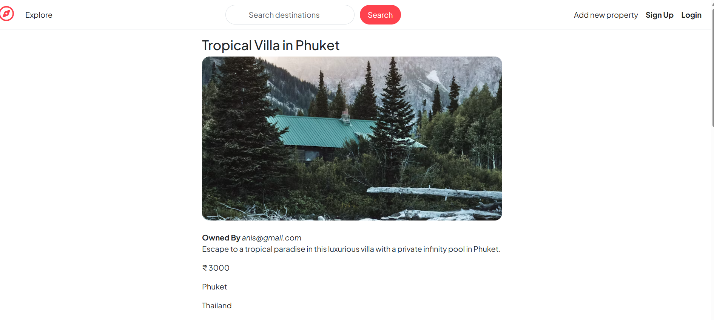

# MERN Stack Hotel Booking Website

A **full-stack hotel booking platform** where users can **book hotels, upload their properties**, and manage bookings. This project is built using the **MERN stack** (MongoDB, Express, React, Node.js), with **Cloudinary** for image storage, **Mapbox** for interactive maps, **EJS** for templating, and robust **authentication & error handling**.

##  Features

- **🏨 Hotel Listings** – Browse available hotels with details and images.
- **🔍 Search & Filter** – Find hotels based on location and price.
- **📍 Map Integration** – View hotel locations using **Mapbox**.
- **📝 Add Properties** – Users can upload their own properties to be booked.
- **📷 Cloudinary Image Upload** – Secure storage of property images.
- **⭐ Reviews & Ratings** – Users can add and view hotel reviews.
- **👥 User Authentication** – Sign up, log in, and manage bookings.
- **🔒 Password Hashing** – Secure user credentials using bcrypt.
- **🍪 Cookies & Sessions** – Remember user login sessions.
- **🌍 Geocoding** – Convert addresses into map locations using Mapbox.
- **⚡ Express & Router** – Modular routing for better backend structure.
- **🔄 Populate Data** – Retrieve related user and property data efficiently.
- **💬 Flash Messages** – Display success/error messages with **connect-flash**.
- **🚨 Error Handling** – Graceful error handling throughout the application.

## 🛠 Tech Stack

### Frontend:
- **React.js** – Modern UI framework.
- **EJS** – Server-side templating for rendering pages dynamically.
- **Tailwind CSS** – For responsive and stylish UI.

### Backend:
- **Node.js & Express.js** – Backend framework.
- **MongoDB & Mongoose** – NoSQL database for storing user & property data.
- **Cloudinary** – For image uploads and management.
- **Mapbox** – Interactive map integration & **Geocoding**.
- **Passport.js & Bcrypt.js** – User authentication & password hashing.
- **Express Router** – Modular API routing.
- **Cookies & Flash** – User sessions & messaging.
- **Error Handling Middleware** – Clean and structured error handling.

## Installation & Setup

**Clone the repository** - `git clone https://github.com/yourusername/lucky-number-game.git`  
**Navigate** - `cd Hotelscape`  
**Start the backebd server** - `node app.js`  
**Open in the browser** - The application will be accessible at `http://localhost:8080`  
## Preview

